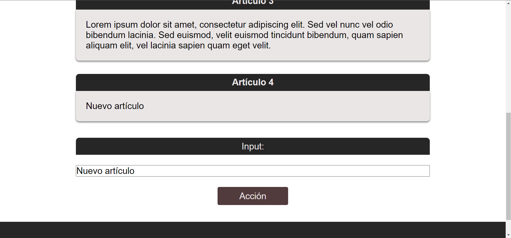

# EJERCICIO 2

### Usando eventos, haced que se añada un nuevo artículo con un texto especificado en un input y cuyo título tenga el número de artículo correspondiente a su orden.

#### Ten en cuenta que deberás añadir los estilos (clases) correspondientes al título &lt;h2&gt; y al texto &lt;p&gt; y que estos deben estar contenidos en una etiqueta &lt;article&gt;

#### Resultado de ejemplo:

